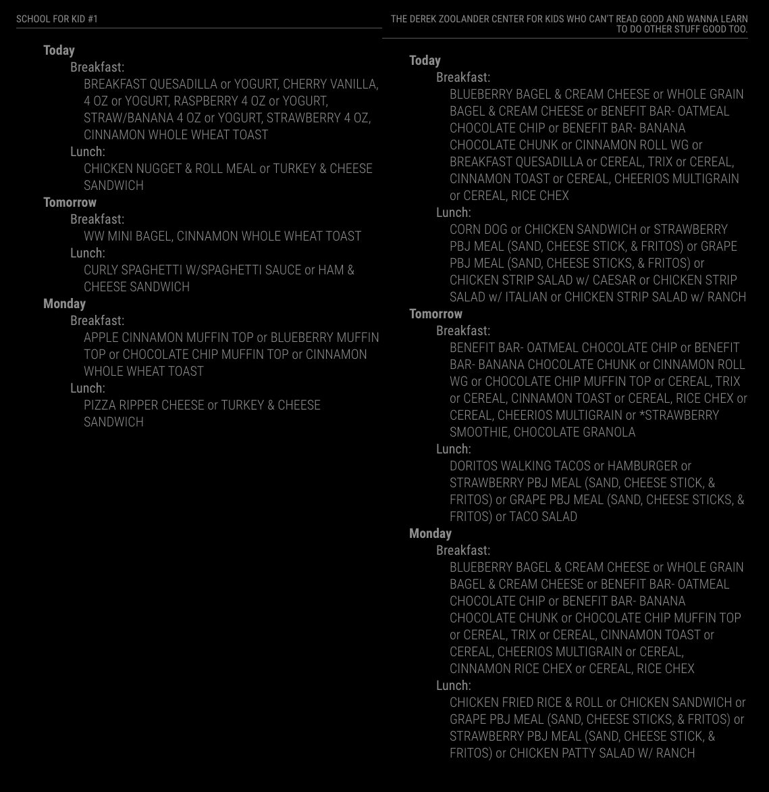

# MMM-TitanSchoolMealMenu

A module for the MagicMirror framework that retrieves a school meal menu from the LinqConnect API (api.linqconnect.com). LinqConnect was formerly known as "Titan Schools" (family.titank12.com).

---


## Usage

Add this to your MagicMirror `config.js`:

```js
    {
        module: "MMM-TitanSchoolMealMenu",
        position: "top_left",
        header: "School Menu",
        config: {
            size: 'medium', // Optional: 'small', 'medium', 'large'; Default: 'medium'
            buildingId: '23125610-cbbc-eb11-a2cb-82fe13669c55',
            districtId: '93f76ff0-2eb7-eb11-a2c4-e816644282bd',
            updateIntervalMs: 3600000, // Optional: Milliseconds between updates; Default: 3600000 (1 hour)
            numberOfDaysToDisplay: 3, // Optional: 0 - 5; Default: 3
            recipeCategoriesToInclude: [
                "Entrees",
                "Grain"
                // , "Fruit"
                // , "Vegetable"
                // , "Milk"
                // , "Condiment"
                // , "Extra"
            ],
            debug: false // Optional: boolean; Default: false; Setting this to true will output verbose logs
        },
    },
```

You can also track multiple school menus by listing the module multiple times in your `config.js` file (each config will probably have a different `buildingId`/`districtId`):

```js
    {
        module: "MMM-TitanSchoolMealMenu",
        position: "top_right",
        header: "The Derek Zoolander Center for Kids Who Can't Read Good and Wanna Learn to Do Other Stuff Good Too.",
        config: {
            buildingId: '7833a90f-a4bc-eb11-a2cb-8711b287b526',
            districtId: '93f76ff0-2eb7-eb11-a2c4-e816644282bd',
        },
    },
    {
        module: "MMM-TitanSchoolMealMenu",
        position: "top_left",
        header: "School for Kid #1",
        config: {
            buildingId: "9017b6ae-a3bc-eb11-a2cb-82fe13669c55",
            districtId: "93f76ff0-2eb7-eb11-a2c4-e816644282bd",
        }
    },
```



---

## Finding your `buildingId` and `districtId`

#### 1. Go to the LinqConnect webpage and search for your school district: https://linqconnect.com/


#### 2. Select your school from the dropdown and use your browser's developer tools to inspect the resulting request to the `/FamilyMenu` endpoint. The `districtId` and `buildingId` will be present as query string parameters on this requests.


