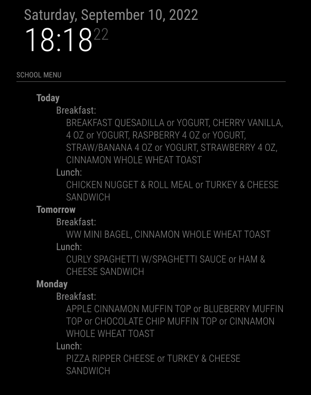
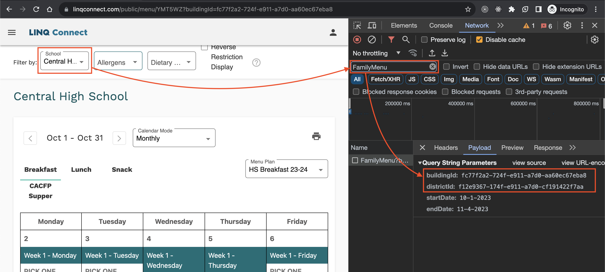

# MMM-TitanSchoolMealMenu

#### A module for the MagicMirror framework that retrieves a school meal menu from the Titan Schools API (family.titank12.com)

## Usage

Add this to your MagicMirror `config.js`:

    {
        module: "MMM-TitanSchoolMealMenu",
        position: "top_left",
        header: "School Menu",
        config: {
            size: 'medium', // Optional: 'small', 'medium', 'large'; Default: 'medium'
            buildingId: '23125610-cbbc-eb11-a2cb-82fe13669c55',
            districtId: '93f76ff0-2eb7-eb11-a2c4-e816644282bd',
            updateIntervalMs: 3600000, // Optional: Milliseconds between updates; Default: 3600000 (1 hour)
            numberOfDaysToDisplay: 3, // Optional: 0 - 5; Default: 3
            recipeCategoriesToInclude: [
                "Main Entree",
                "Grain"
                // , "Fruit"
                // , "Vegetable"
                // , "Milk"
                // , "Condiment"
                // , "Extra"
            ]
        },
    },

## Finding your `buildingId` and `districtId`

#### 1. Go to the Titan Schools webpage and search for your school district: https://family.titank12.com/

#### 2. Enter your state (or refine with city and state)

#### 3. Use your browser's developer tools to inspect a request to the `/FamilyMenu` endpoint. The `districtId` and `buildingId` will be present as query string parameters on these requests.

